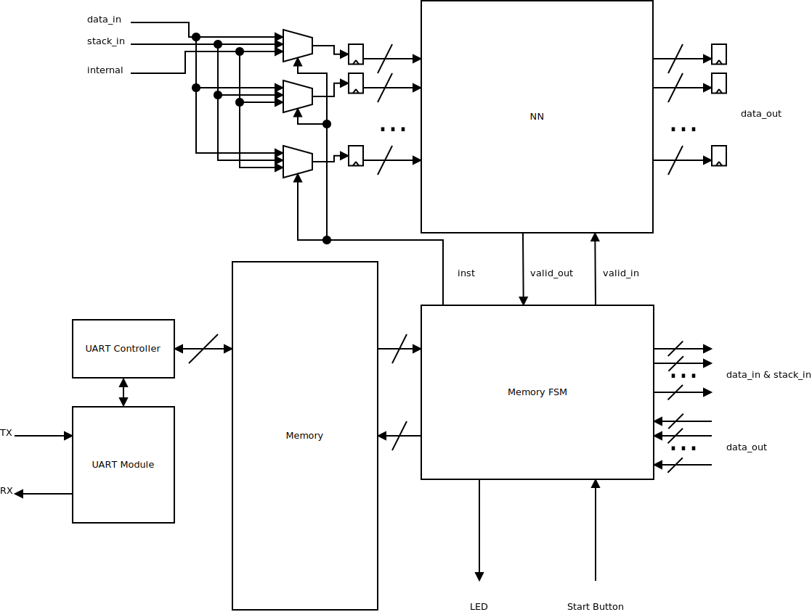
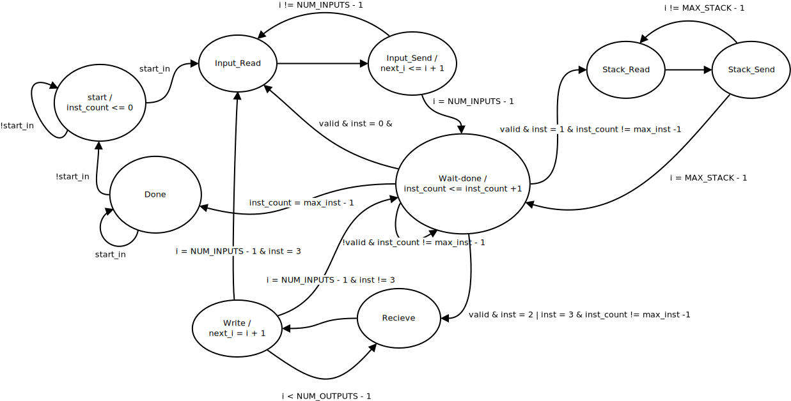

# Hardware Accelerator

The hardware accelerator consists of 3 main parts
- The neural network
- The memory and memory FSM
- The UART module and controller

The structure of hardware accelerator is shown in the image below

## Neural Network

The neural network is described using the generator and then connected to the memory FSM for control of data. The neural net will first start calculating when the Valid_in signal is high. When the neural net is done calculating and is the output data is valid, it holds the Valid_out signal high.

## Memory and Memory FSM

The state diagram of the memory FSM is shown in the image below

## UART Control