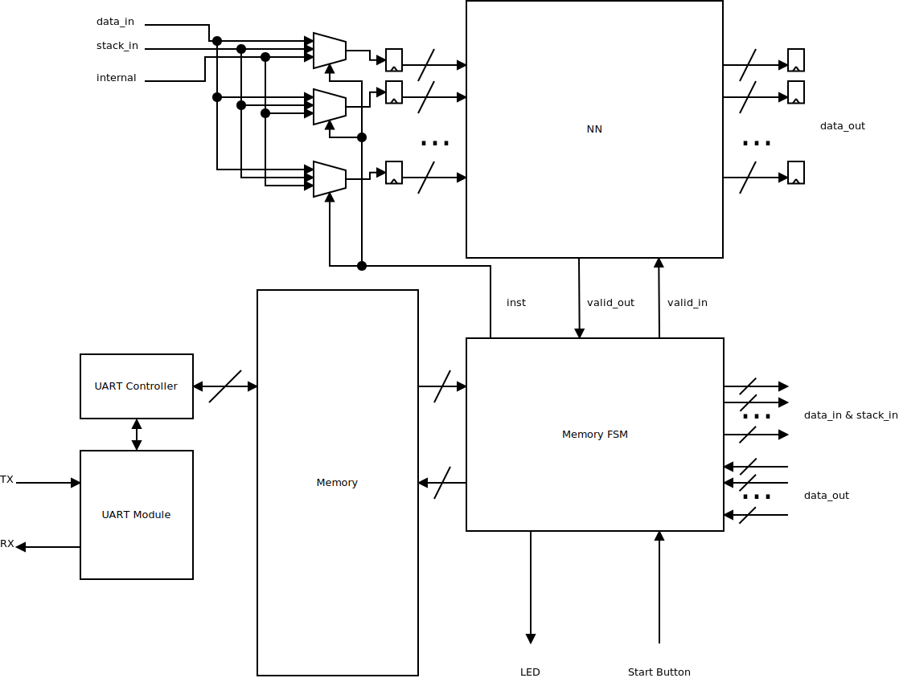
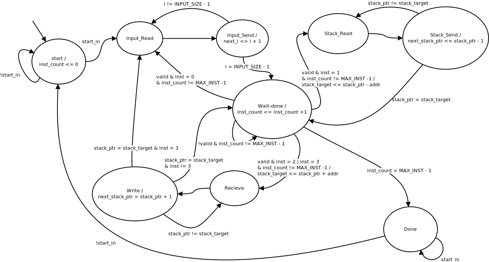

# Hardware Accelerator

The hardware accelerator consists of 3 main parts
- The neural network
- The memory and memory FSM
- The UART module and controller

The structure of hardware accelerator is shown in the image below

## Neural Network

The neural network is described using the generator and then connected to the memory FSM for control of data. The neural net will first start calculating when the `valid_in` signal is high. When the neural net is done calculating and is the output data is valid, it holds the `valid_out` signal high.

The generator also generates a definitions VHDL file with constants needed to generate the neural net. In this file there is also an array of instructions, where the 3 lower bits are the instruction number and the 16 upper bits are the the memory address needed for this instruction. There are 5 different types of instructions:

- 0 : Load in
- 1 : Load stack
- 2 : Push
- 3 : Push and Load in
- 4 : Load in and Load stack

A more detailed description of the different operators currently implemented can be found by following this [link](operators/README.md).

## Memory and Memory FSM

The memory is split into two sections, the input and the stack. The input section stores the input sent from the interface over UART. The data stored in this section is only read by the memory FSM, and only modified by the UART controller. The stack section is used to store results from the neural network. These can either be fed back into the neural network as an input, or they can be read out by the UART controller, when the total neural net is done calculating. 

The memory FSM is responsible for sending data to the neural network, and store the results in memory. When the memory FSM has data ready at the input of the neural network, it sets the `valid_in` signal high to start the calculations in the neural network. When the memory FSM receives the `valid_out` signal from the neural net, it can got into one of four different states depending on the type of instruction is the current one. 

The state diagram of the memory FSM is shown in the image below

The memory FSM also sends the current instruction to the neural net, to be able to select between wether the input to the neural net should be from the input section of the memory, from the stack section of the memory or if it should be the output of the previous layer.

## UART Control

To communicate with the interface and have data to input into the neural network, a UART module is needed. For this project the VHDL UART module by Peter Bennett ([Link](https://github.com/pabennett/uart)). This is connected to a UART controller FSM, written by Luca Pezzarossa. This loads data sent from UART into a specific section of memory, and sends the data from another part of memory back over UART to an interface.
