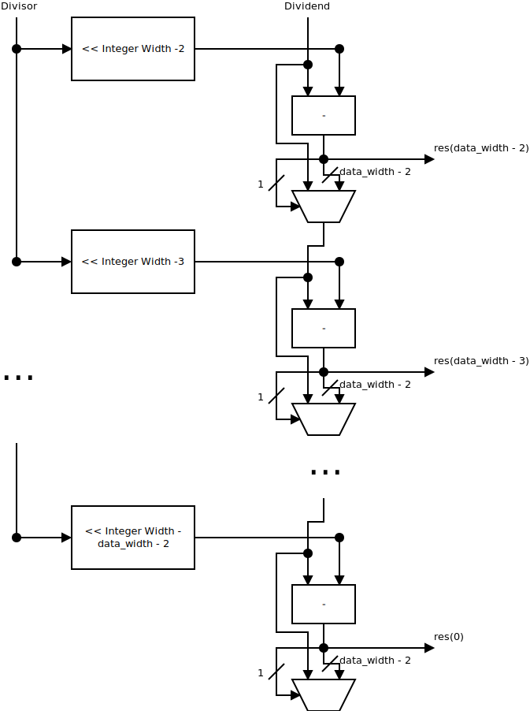

# Operators

## Fixed point representation

As most values used for a neural net are between -1 and 1 we have chosen to use an s7.8 fixed point representation of our numbers, meaning we have 1 bit for the sign, seven bits for the integer representation and 8 bits for the decimal representation. We have chosen this format as we during some parts of the calculation end up with results which are more than 1. The format can be explored in detail by using the [Q-format Converter & Calculator](https://chummersone.github.io/qformat.html).

## ONNX operators implemented

All operators are implemented based on the ONNX version 1 description of each of them. All operators have also been implemented with a Finite State Machine(FSM) to reduce the area of the generated circuit, and make it possible to synthesize on smaller FPGAs. On the Add and Div operators we expect both inputs to have the same dimensions. If this is not the case, the smallest of the two is broadcasted to fit the dimensions of the larger. This is done in the [generator](../../generator/README.md), where a broadcasting component is inserted when needed.

### Div

The division operator has been implemented by having an index to chose which input values should be divided with each other. The division itself is a fixed-point division component, specifically implemented to handle different fixed-point formats, though all signed. The divisor  is first left shifted by the integer width - 2. If this value is negative, it is right shifted by the absolute value of it instead.  
Once the divisor has been shifted, it is subtracted from the dividend. If this number is negative it means that the divisor is bigger than the dividend. The divisor is then right shifted once and the divisor is then subtracted from the dividend. If the subtraction result if positive the subtraction result is used as the dividend when the divisor is right shifted.  
A block diagram of the fixed-point division unit can be seen in the image below.

Then for each of the values being divided an index is used to select which values should be divided with each other, which is then set to the corresponding output index.

### Add

The addition operator has been made by having an index to chose which of the input values should be added together. The result of this is then set to the corresponding index of the output.

### Relu

The Relu operator uses an index to select which value from the input should be checked and used for the corresponding output. To check if the value is negative or not, the most significant bit is checked. This bit is the sign bit in our fixed-point representation, and if it is set it means the value is negative. This means we can use this bit as a selector for a mux, selecting between either the value itself or 0.

### MatMul

### MaxPool

The MaxPool operator uses different indexes to select between the different kernels. These indexes are set and updated in the FSM while the kernel wires are generated with generator for-loops. A component for choosing the maximal value out of an array of values has been created which is connected to each kernel through muxes for the different values in the kernels. 

### Conv

