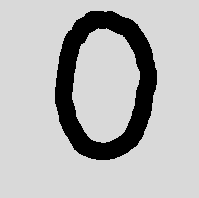
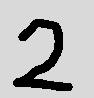
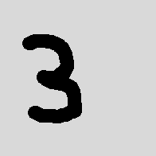
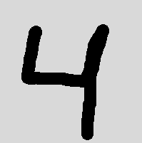
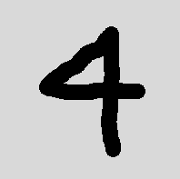
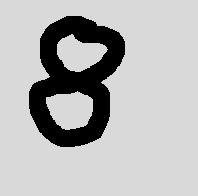
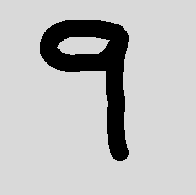
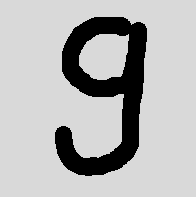

# Results From Simulation

By creating images of different numbers in our interface program and exporting them, we can run our simulation on them and see what the neural network finds

Bellow is the images we have used together with a number indicating which index it has, bellow that is a table with the models predictions.

|Prediction|0-1|1-1|2-1|3-1|4-1|4-2|5-1|6-1|6-2|7-1|7-2|8-1|9-1|9-2|
|-|:---------:|:---------:|:---------:|:---------:|:---------:|:---------:|:---------:|:---------:|:---------:|:---------:|:---------:|:---------:|:---------:|:---------:|
||||||||||||||||
|9|-1.26953125  |-0.8515625 |-2.58984375   |-0.9140625    |-0.52734375   |-0.6875       |-0.375       |-1.5859375 |-0.11328125   |-1.37890625   |-1.6171875    |-2.68359375  |*-2.53125* |*-1.3984375*|
|8|-1.28125     |0.2578125  |-1.234375     |-2.0859375    |-3.234375     |-0.51953125   |-0.2265625   |-1.05078125|-1.6015625    |-0.06640625   |-1.16015625   |*-1.95703125*|**1.1640625**|0.625      |
|7|**2.0703125**|0.8125     |-0.05078125   |**1.14453125**|**3.86328125**|**2.12109375**|**1.90625**  |0.67578125 |**4.38671875**|*0.3125*      |*1.40625*     |**1.16796875**|0.91796875 |0.23046875 |
|6|-1.07421875  |-1.83984375|-0.796875     |-1.05859375   |-0.77734375   |-0.44140625   |-0.3671875   |*-0.046875*|*-1.765625*   |**2.29296875**|**2.22265625**|1.046875   |0.84375    |1.37890625 |
|5|0.71875      |-0.109375  |**2.76953125**|0.12109375    |-0.21484375   |-0.76953125   |*-1.23046875*|0.265625   |1.79296875    |-0.51171875   |-0.98046875   |-0.3125    |-0.7265625 |0.62890625 |
|4|-0.54296875  |0.703125   |-1.8359375    |-2.21875      |*-0.9296875*  |*0.76953125*  |0.21875      |-1.36328125|-0.0234375    |-0.25390625   |1             |0.1015625  |1.015625   |**1.4453125**|
|3|-1.65625     |-3.28125   |-1.87890625   |*-1.40234375* |-2.78515625   |-2.50390625   |-2.41015625  |-1.63671875|-2.34375      |-1.91015625   |-2.30859375   |-1.83984375|-2.8203125 |-3.28125   |
|2|0.8984375    |-0.21484375|*0.6953125*   |0.3046875     |1.640625      |-1.01953125   |-0.30859375  |**1.59375**|-2.8203125    |0.0703125     |0.02734375    |0.59375    |0.0390625  |-0.53515625|
|1|1.00390625   |**2.125**  |1.140625      |0.5390625     |2.01171875    |1.26953125    |0.96484375   |-1.75      |0.6875        |-1.890625     |-1.0078125    |0.51171875 |-0.08203125|-0.2421875 |
|0|*-1.3203125* |-0.88671875|-1.16015625   |0.62109375    |-0.55078125   |-1.08984375   |-1.1171875   |0.22265625 |-1.6015625    |-0.12890625   |-0.6171875    |-0.0390625 |-0.78125   |-0.109375  |

**Bold** text is the highest value

*Italic* is the correct answer

# Results from synthesis

Below is the utilization report of slice logic for the synthesized design, when it is synthesized for the Nexys 4 DDR FPGA.

|        Site Type        |   Used  | Fixed | Prohibited | Available |  Util%  |
|-------------------------|---------|-------|------------|-----------|---------|
| Slice LUTs              | 1477905 |     0 |          0 |     63400 | 2331.08 |
|   LUT as Logic          | 1477905 |     0 |          0 |     63400 | 2331.08 |
|   LUT as Memory         |       0 |     0 |          0 |     19000 |    0.00 |
| Slice Registers         |  607512 |     0 |          0 |    126800 |  479.11 |
|   Register as Flip Flop |  607421 |     0 |          0 |    126800 |  479.04 |
|   Register as Latch     |      91 |     0 |          0 |    126800 |    0.07 |
| F7 Muxes                |  225419 |     0 |          0 |     31700 |  711.10 |
| F8 Muxes                |   98353 |     0 |          0 |     15850 |  620.52 |